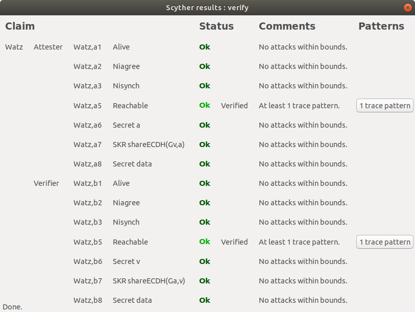

# Formal verification of the remote attestation protocol
We use [Scyther](https://people.cispa.io/cas.cremers/scyther/) [1] to formally prove the correctness of the remote attestation protocol designed for WaTZ.
The formalisation of the protocol can be found in file `scyther_watz.spdl`.
All the claims passed on the Scyther (v1.1.3, Linux).

## Validation output

[1] [The Scyther Tool: Verification, Falsification, and Analysis of Security Protocols](https://link.springer.com/chapter/10.1007/978-3-540-70545-1_38)